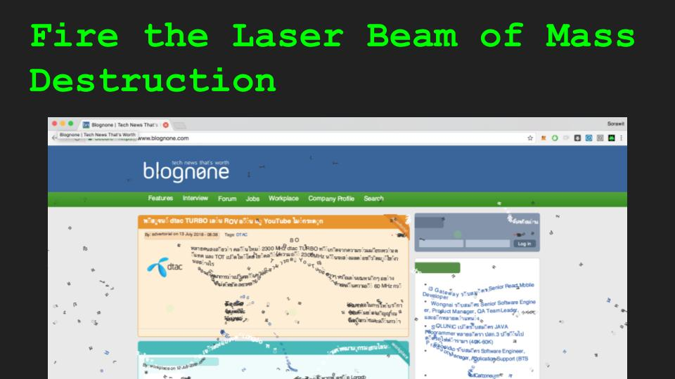

# Internet Destroyer





# Build Chrome Extension

```
yarn install
yarn chrome-watch
```

# Install in Dev mode

https://stackoverflow.com/questions/24577024/install-chrome-extension-not-in-the-store

**Load unpack module** (see link below) from `internet-destroyer\build\chrome`.

# Invasion Plan

Do it at your own pleasure! The more the better!
